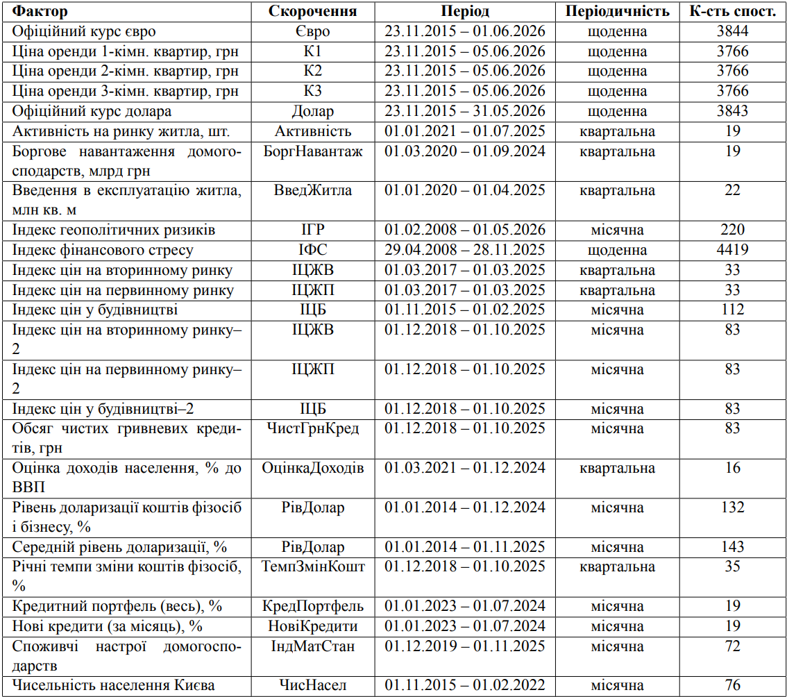
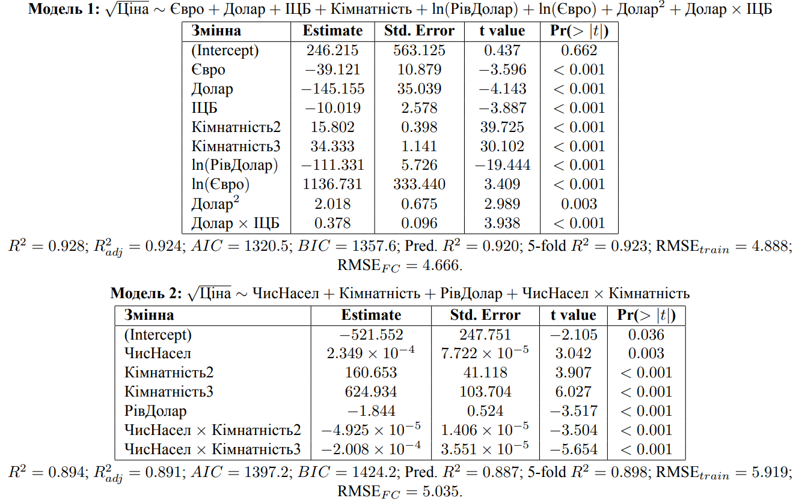
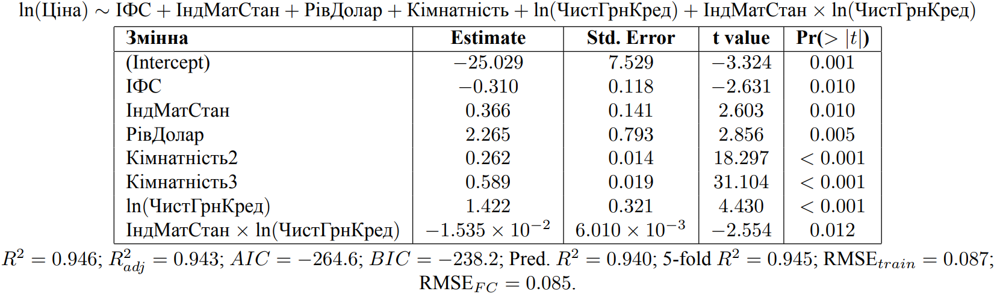
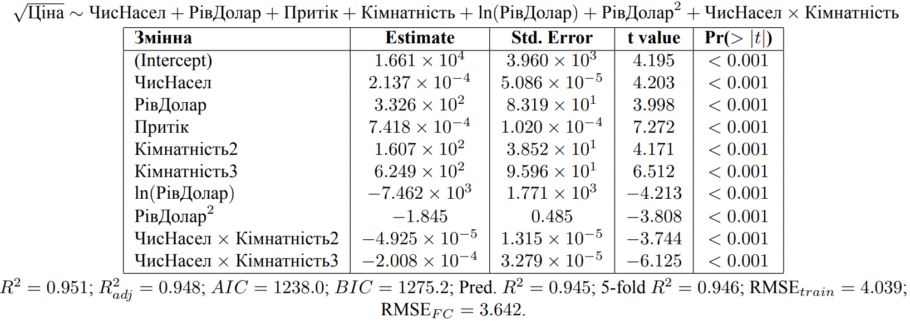

# Analysis of the Impact of Macroeconomic and Social Factors in Rental Housing Price Forecasting in Kyiv

> An academic project focused on regression modeling and time series forecasting (extending to AR(1) models) using mainly real-world datasets.

## 📈 Methodology
1. **Data Preprocessing & EDA:** Cleaning datasets parsed from state websites and real estate portal, handling missing values, and analyzing distributions. As a result, the dataset has been dшvided into two periods: prewar (11/2015 - 12/2021) and war (01/2022 - 06/2026).
Potential influencing factors, along with their abbreviations, observation periods, frequency and number of observations, are presented in the following table:

2. **Baseline Regression:**
   * Correlation analysis.
   * Building full model and applying transformations to response and/or predictor variables.
   * Regression diagnostics and correction of violations.
   * Variable selection. At this stage, we may have different equally good models.
   * Including interaction terms.
   * Model validation and selection of the best model.

3. **Population Inflow modeling:** using Markov process to model Kyiv population inflow for 2016 - 2022 time period and including this variable to separate model.

4. **Time Series Extension to AR(1) (beyond the scope of academic research):** 
   * In process :)
---

## **💡Key Results & Insights**
For each of two time periods I have built separate models for single-, double-, triple-room appartments and the combined model in which "Number_of_rooms" ("Кімнатність") is a categorical variable. For instance, **summary for final combined models for the 1st period** along with its validation metrics is presented in the following image.

**Summary for final combined model for the 2nd period**:

In addition, separate **model with modeled variable "Inflow" ("Притік")** was build for the first time period. It's summary is shown below.

---

## 📄 Full Thesis & Documentation
If you are interested in the theoretical background used and comprehensive statistical analysis of this research, you can read the full academic text (Ukrainian only):
* **[Read Full Thesis (PDF)](docs/Аналіз впливу макроекономічних і соціальних факторів на прогнозування цін оренди житла в Києві.pdf)**
